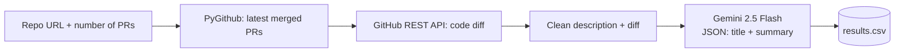

<div align="center">

# 🔍 Gemini PR Summarizer

### Turns messy pull requests into clear titles and summaries, by reading the actual code changes.

Give it a GitHub repository, and it fetches the latest merged pull requests, reads each one's **code diff and description**, and asks **Google Gemini** to write a short, clear title and a technical summary. Everything is saved to a CSV so you can compare the AI's version with the original side by side.


[Example](#example) · [How it works](#how-it-works) · [Design decisions](#design-decisions) · [Run it](#run-it-yourself)

</div>

---

## 💬 Why I built it

Pull request titles are often written in a hurry. In large projects you see titles like *"MNT ..."*, *"FEA ..."* or a description that is just the unfilled PR template. A reviewer has to open the diff to understand what actually changed.

I wanted to see whether a language model could read the **code changes themselves** and explain them better than the original title does. I built this for my Application Lifecycle Management course (CS 453) at Bilkent University and tested it on **scikit-learn**, one of the most active Python projects on GitHub.

<a id="example"></a>

## 👀 Real results on scikit-learn

These come from an actual run on 8 recently merged scikit-learn PRs ([full CSV](examples/scikit-learn_results.csv)):

| PR | Original title | Title generated by Gemini |
|---|---|---|
| #32835 | MNT Use Pyodide 0.29 version to avoid micropip error inside JupyterLite | **Update Pyodide to 0.29.0 for JupyterLite** |
| #32804 | CI Make linting bot comment only on failure | **Refactor Linter Bot: PyGithub and Conditional Commenting** |
| #32422 | FEA Add array API support for brier_score_loss, log_loss, d2_brier_score and d2_log_loss_score | **Add Array API Support for Brier and Log Loss Metrics** |

And a generated summary, for **#32804**, where the original description was mostly the empty PR template:

> *Refactored the linter bot's comment system to only post comments when linting fails and automatically remove them upon success. The `build_tools/get_comment.py` script was updated to replace direct HTTP requests with the `PyGithub` library for all GitHub API interactions, including comment management and label updates.*

Notice that the summary mentions a **file name and a library change that only appear in the diff**, not in the original description. That's the whole point of the tool.

<a id="how-it-works"></a>

## ⚙️ How it works

1. **You enter a repository URL** and how many PRs to process.
2. **PyGithub finds the most recently updated closed PRs** and keeps only the ones that were actually merged.
3. **For each PR, the tool downloads the raw code diff** through the GitHub REST API and combines it with the PR description.
4. **Gemini (`gemini-2.5-flash`) receives the diff and description** and must answer in a fixed JSON format with a title and a summary.
5. **Everything is written to `results.csv`:** PR number, original title, generated title, original description and generated summary.



<a id="design-decisions"></a>

## 🧭 Design decisions (and why I made them)

| Decision | Why |
|---|---|
| **Send the code diff, not only the description** | Descriptions are often empty or just a template. The diff is the only reliable source of what really changed |
| **Force a JSON schema on Gemini's answer** | With a required `Generated_Title` and `Generated_Summary`, the output can be parsed and saved to CSV without guessing |
| **Truncate diffs at 50,000 characters** | Very large PRs would exceed what's reasonable to send in one request, so long diffs are cut and marked as truncated |
| **Skip PRs whose diff is missing or very short** | There isn't enough content for a meaningful summary, so the tool logs it and moves on instead of crashing |
| **Wait 1 second between PRs** | Keeps the tool gentle on both the GitHub and Gemini APIs |
| **Remove hidden HTML comments from descriptions** | Many projects use PR templates full of `<!-- instructions -->`. Stripping them keeps only what the author actually wrote |
| **Never show secrets on screen** | Tokens are read from environment variables, or typed in hidden if they're not set |
| **Handle errors per PR** | One failing PR is skipped with a message, and the rest are still processed |

## 🧠 What I found

- **Gemini's titles were often clearer than the originals**, especially when the original used short labels like `MNT` or `FEA`.
- **Summaries were most accurate when Gemini used the diff** and named concrete functions, files or API changes.
- **They were weaker when Gemini mostly repeated the original description** without implementation details.
- **For code review, this kind of automation saves time:** a reviewer can understand the main change before reading every line.

## 🔭 What I'd improve next

- [ ] Let the user choose output formats (Markdown or JSON, not only CSV)
- [ ] Add a small evaluation step that scores generated titles against the originals
- [ ] Post the generated summary back to the PR as a comment through a GitHub Action
- [ ] Add unit tests with mocked GitHub and Gemini responses

<a id="run-it-yourself"></a>

## 🚀 Run it yourself

**You'll need:** Python 3.10+, a [GitHub personal access token](https://github.com/settings/tokens) (no extra scopes needed for public repositories) and a [Gemini API key](https://aistudio.google.com/apikey).

```bash
git clone https://github.com/gizemgokceisik/gemini-pr-summarizer.git
cd gemini-pr-summarizer

python -m venv venv
source venv/bin/activate        # Windows: venv\Scripts\activate
pip install -r requirements.txt
```

Optionally set your keys as environment variables so you don't have to type them each time:

```bash
export GITHUB_TOKEN=your_github_token        # Windows (PowerShell): $env:GITHUB_TOKEN="..."
export GEMINI_API_KEY=your_gemini_api_key    # Windows (PowerShell): $env:GEMINI_API_KEY="..."
```

Then run:

```bash
python main.py
```

```text
--- Gemini Pull Request Summarizer ---
Enter the GitHub Repo URL: https://github.com/scikit-learn/scikit-learn
Enter the Number of PRs to summarize and generate a title for: 8
```

The results are saved to `results.csv` in the project folder.

## 🧰 Built with

**Language** Python<br>
**AI** Google Gemini API (`google-genai`, `gemini-2.5-flash`)<br>
**GitHub** PyGithub · GitHub REST API (`requests`)<br>
**Output** CSV

---

<div align="center">

Built by **Gizem Gökçe Işık** · Bilkent University, CS 453 Application Lifecycle Management, Fall 2025

[LinkedIn](https://linkedin.com/in/gizemgokceisik) · [GitHub](https://github.com/gizemgokceisik)

</div>
